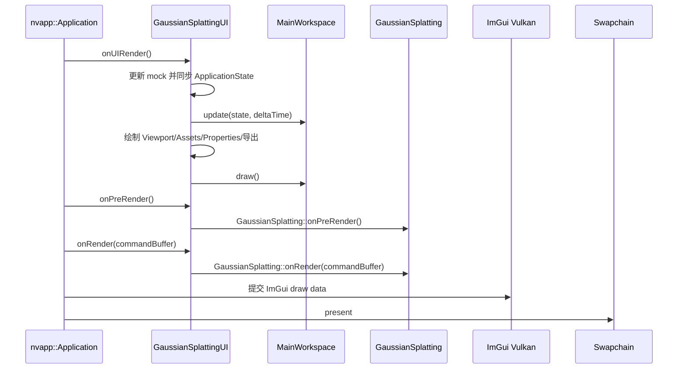

# 启动与逐帧流程

[返回入口](00_START_HERE.md) · [状态与数据流](05_STATE_AND_DATA_FLOW.md) · [文件索引](07_FILE_INDEX.md)

本文解释原生程序从 `main()` 到窗口呈现的真实调用路径，并标出项目层与上游渲染核心的边界。相关所有权见 [03_SOURCE_OWNERSHIP.md](03_SOURCE_OWNERSHIP.md)，状态同步见 [05_STATE_AND_DATA_FLOW.md](05_STATE_AND_DATA_FLOW.md)。

## 启动顺序

| 顺序 | 入口与位置 | 主要动作 | 维护归属 |
|---|---|---|---|
| 1 | `main()` — `vk_gaussian_splatting/src/main.cpp` | 创建性能分析器、参数注册器并解析命令行 | 集成层 |
| 2 | `nvvk::Context::init` | 初始化 Vulkan context、扩展和设备 | 上游框架 |
| 3 | `nvapp::Application` | 创建窗口和应用容器 | 上游框架 |
| 4 | `appInfo.dockSetup` | 调用 `buildMonitoringDockLayout(viewportID)` 建立项目默认布局 | 项目层 |
| 5 | `application.init` | 初始化应用与 ImGui/Vulkan 资源 | 上游框架 |
| 6 | `addElement(...)` | 按顺序加入 Sequencer、`GaussianSplattingUI`、标题、Camera、GPU Monitor、Profiler | 集成层 |
| 7 | `GaussianSplattingUI::onAttach` | 先执行 `GaussianSplatting::onAttach`，再初始化导出预览、模拟数据源和 `MainWorkspace` | 集成层 + 项目层 |
| 8 | `application.run()` | 进入消息循环和逐帧调度 | 上游框架 |
| 9 | `onDetach` / `deinit` | 先释放项目 UI/导出资源，再释放渲染核心、应用和 Vulkan context | 各层各自负责 |

`GaussianSplattingUI::onAttach()` 必须保留对 `GaussianSplatting::onAttach(app)` 的调用；移除或调整它的先后顺序会影响 GBuffer、管线、场景和相机资源的初始化。

## 每帧调用顺序

`nvapp::Application::drawFrame()` 对每个 element 依次执行以下阶段：

| 阶段 | 实际函数与文件 | 职责 | 来源/适合修改性 |
|---|---|---|---|
| 菜单 | `GaussianSplattingUI::onUIMenu()` — `src/gaussian_splatting_ui.cpp` | File/View 菜单、窗口开关和受保护快捷键 | 集成接缝；可小步修改并人工验证 |
| UI | `GaussianSplattingUI::onUIRender()` — 同上 | 同步状态、处理场景请求、绘制 Viewport 和项目 UI | 集成接缝；高风险，避免改渲染所有权 |
| 项目更新 | `MainWorkspace::update()` — `src/main_workspace.cpp` | 历史采样、导航路径、状态转换日志 | 本项目；适合单一行为修改 |
| 项目绘制 | `MainWorkspace::draw()` — 同上 | 绘制所有 monitoring 窗口与状态栏 | 本项目；适合按面板修改 |
| 渲染准备 | `GaussianSplattingUI::onPreRender()` → `GaussianSplatting::onPreRender()` | 更新渲染前资源/状态 | 上游核心委托；原则上不改 |
| GS 渲染 | `GaussianSplattingUI::onRender(cmd)` → `GaussianSplatting::onRender(cmd)` | 向 command buffer 记录 GS 渲染 | 上游核心委托；原则上不改 |
| ImGui 提交 | `nvapp::Application::drawFrame()` — `nvpro_core2/nvapp/application.cpp` | 将 ImGui draw data 记录到 Vulkan command buffer | 上游框架；禁止在项目任务中改 |
| Present | `nvapp::Application::drawFrame()` — 同上 | 提交并呈现 swapchain image | 上游框架；禁止在项目任务中改 |

要点：

- `onUIRender()` 先于当帧的 `onPreRender()` 和 `onRender()`；项目监控数据、窗口和命令请求主要在 UI 阶段处理。
- `Viewport` 通过 GBuffer descriptor 显示渲染结果；不要在 `MainWorkspace` 中复制或持有 Vulkan image、descriptor 或 command buffer。
- Camera element 在 `GaussianSplattingUI` 之后加入应用，因此其 `onUIRender()` 输入处理发生在 `GaussianSplattingUI::onUIRender()` 之后、渲染准备之前；具体逻辑仍由上游 element 生命周期负责。全局键盘快捷键使用 `WantTextInput`、`IsAnyItemActive()` 和 `WantCaptureKeyboard`/Viewport hover 条件，地图鼠标操作只在 canvas hover 时处理。
- `m_mainWorkspace.draw()` 位于 `GaussianSplattingUI::onUIRender()` 尾部附近；项目窗口仍是同一 ImGui frame 的组成部分。
- 场景请求可能来自命令行、File 菜单或文件拖放，最终仍由 `GaussianSplattingUI` 的加载逻辑交给现有 loader。

## `GaussianSplattingUI::onUIRender()` 内部顺序

1. 更新 `MockRobotDataSource`、`MockSensorDataSource`、`MockTrainingDataSource`。
2. 把数据源 snapshot 写入 `ApplicationState`。
3. 从真实 Gaussian Splatting 对象更新场景摘要、渲染状态和 profiler 指标。
4. 调用 `MainWorkspace::update()`，推进图表、导航轨迹和事件日志。
5. 绘制名为 **`Viewport`** 的原窗口，并处理场景加载/loader 状态。
6. 绘制导出预览和 `MainWorkspace` 的项目面板。
7. 绘制原有 `Assets` 与 `Properties` 窗口（具体可见性受 UI 状态控制）。

## 可以安全插入逻辑的位置

- 新的纯 UI 状态：优先放入 `ApplicationState`，由 `MainWorkspace::update/draw` 使用。
- 新的遥测采样：通过 `IDataSource` 风格接口提供 snapshot，再由集成层同步到 `ApplicationState`。
- 新窗口：在 `MainWorkspace` 内实现绘制函数，并在默认 dock builder 与 View 菜单中同时补齐入口。
- 真实渲染设置：继续使用上游 parameter registry 或现有核心接口，不要在项目状态中复制一份“假权威值”。

不应插入的位置：上游逐帧调度器、Vulkan 提交流程、GBuffer 生命周期和第三方依赖目录。除非任务明确要求渲染核心变更，并且已经准备独立验证方案。
