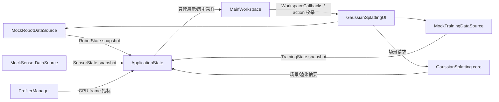

# 状态与数据流

[返回入口](00_START_HERE.md) · [启动与逐帧流程](04_STARTUP_AND_FRAME_FLOW.md) · [UI 面板地图](06_UI_PANEL_MAP.md)

项目采用“数据源 snapshot → `ApplicationState` → `MainWorkspace`”的单向读取路径；`app_actions.h` 定义动作枚举/值类型，`WorkspaceCallbacks` 保存从 workspace 回到集成层的回调。它避免项目面板直接依赖 Vulkan 或具体 loader 实现。

## 关系图

## 各对象职责

| 对象 | 权威范围 | 不应负责 |
|---|---|---|
| `ApplicationState` | 当前 UI 可见的项目、场景、环境、机器人、传感器、训练、导航、日志和渲染状态 | Vulkan 资源所有权、后台线程、磁盘加载 |
| `app_actions.h` | 定义 `ControlMode`、`TrainingCommand`、`CommandStatus` 和轻量 action 值类型 | 保存业务状态、执行逻辑或 Vulkan 命令 |
| `WorkspaceCallbacks` | 保存 `requestControlMode`、`requestTrainingCommand`、`resetMockTraining` 三个回调 | 充当长期状态容器 |
| `IRobotDataSource` | 机器人 snapshot 与控制请求的抽象边界 | ImGui 绘制 |
| `ISensorDataSource` | 传感器 snapshot 的抽象边界 | 图表窗口布局 |
| `ITrainingDataSource` | 训练 snapshot 和训练命令的抽象边界 | 场景加载 |
| `Mock*DataSource` | 可重复、无需外部服务的演示数据 | 冒充真实硬件/训练后端 |
| `MainWorkspace` | 面板绘制、历史环形缓冲、导航轨迹、事件日志和布局复位 | 场景/GPU 资源生命周期 |
| `GaussianSplattingUI` | 将上游核心、数据源和项目 UI 接起来 | 在面板代码中复制核心渲染实现 |

## `ApplicationState` 的主要分区

- `ProjectUiState`：项目标识和概要。
- `SceneUiState`、`EnvironmentMockState`：真实场景摘要与模拟环境参数。
- `RobotState`、`SensorState`、`TrainingState`：当前 snapshot。
- `TrainingHistory`：最多 800 个训练样本。
- `PerformanceHistory`：最多 500 个性能样本。
- `NavigationState`：当前机器人位置、目标和最多 1000 个轨迹点。
- `LogState`：最多 800 条事件。
- `UiState`：窗口显示开关和布局相关状态。
- `RenderStatusView`：loader、GPU frame 等面向 UI 的渲染摘要。

这些固定容量由 `RingBuffer<T, Capacity>` 控制；满容量后覆盖最旧记录，不会无限增长。

## 示例 1：暂停训练

1. 用户在 `Training Monitor` 点击 Pause。
2. `MainWorkspace` 使用 `TrainingCommand::Pause` 调用 `WorkspaceCallbacks::requestTrainingCommand`。
3. `GaussianSplattingUI` 把请求转发给 `MockTrainingDataSource`。
4. mock 修改自己的内部训练状态。
5. 下一次 `onUIRender()` 读取新 snapshot 并写入 `ApplicationState::training`。
6. `MainWorkspace::update()` 观察到状态转换，追加事件日志并停止 Running 状态下的训练曲线采样。

未来接入真实训练后端时，应替换数据源实现和动作转发，不应重写 Training Monitor。

## 示例 2：机器人导航显示

1. `MockRobotDataSource::update()` 按固定时间步产生位置、姿态、电量和控制结果。
2. 集成层将 `RobotState` snapshot 写入 `ApplicationState`。
3. `MainWorkspace::update()` 约每 100 ms 采样位置并压入导航轨迹环形缓冲。
4. `Robot & Sensors` 展示当前值，`Navigation Map` 展示当前位置、目标与历史路径。

导航图当前是 UI 可视化，不是规划器或真实地图；不得据此宣称已经接入 SLAM、导航栈或机器人硬件。

## 示例 3：加载场景

1. 命令行、File 菜单或文件拖放生成场景文件请求。
2. `GaussianSplattingUI` 验证扩展名和当前 loader 状态。
3. 现有 loader 读取 PLY/SPZ，并更新 Gaussian Splatting 核心对象。
4. UI 从核心对象派生 scene summary 和 loader status，写入 `ApplicationState`。
5. `Scene & Environment` 与状态栏显示摘要；实际渲染仍由 `GaussianSplatting` 核心负责。

场景对象的权威来源是渲染核心，不是 `SceneUiState`。`SceneUiState` 是展示模型，不能用于重建 GPU 场景。

## Mock 与真实数据边界

当前以下内容明确为 Mock：机器人遥测、传感器读数、训练过程、环境控制效果和导航路径。真实内容包括：已加载 Gaussian 场景、viewport 图像、loader 状态以及从 profiler 获取到的可用渲染指标。

新增真实后端时建议：

1. 保持接口 snapshot 语义。
2. 明确线程边界，在 UI 线程只交换稳定副本。
3. 给连接失败、数据过期和无数据定义显式状态。
4. 保留 mock 作为离线回归模式，并继续显示 `MOCK` 标记。
